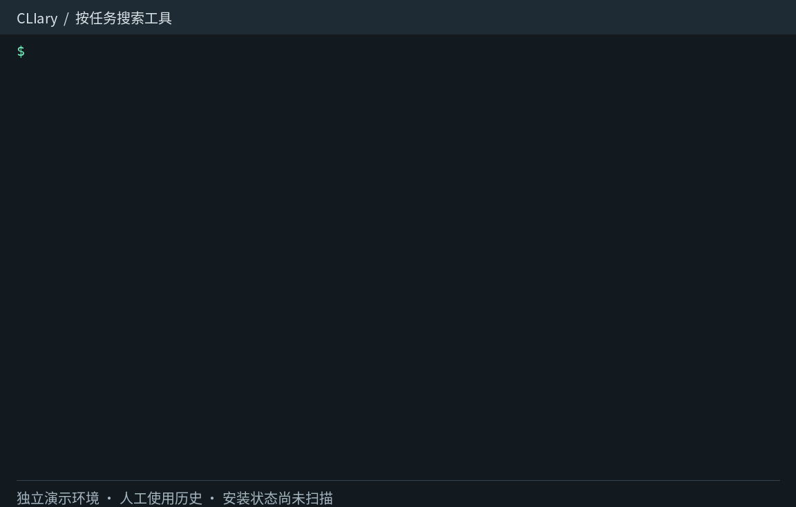
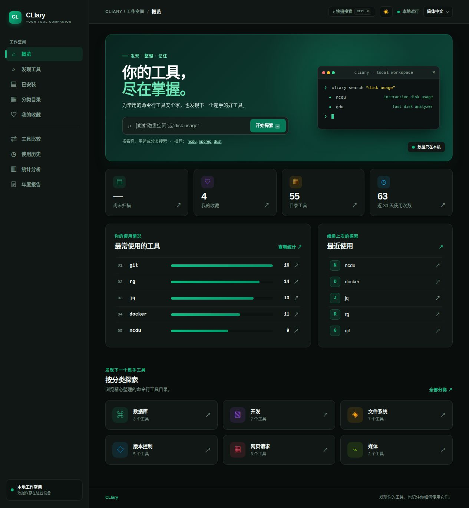
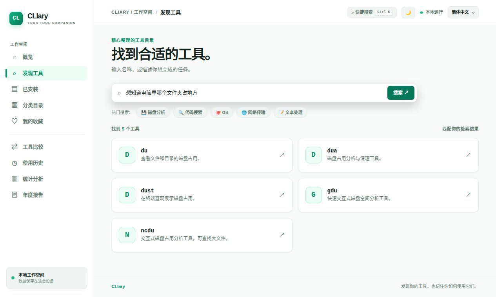
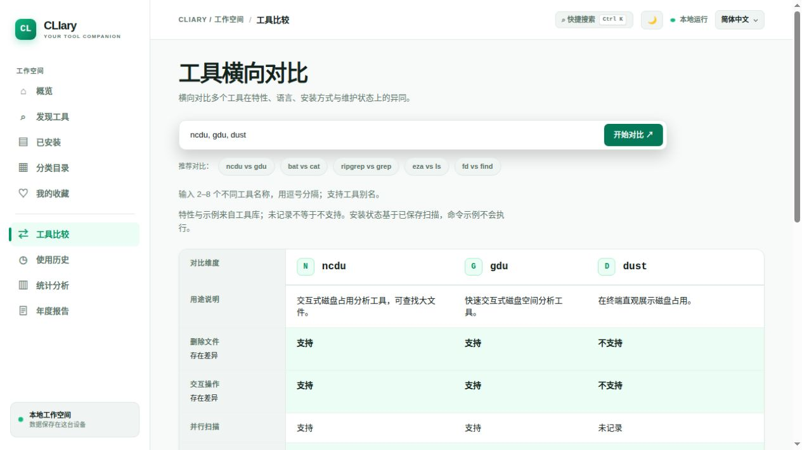
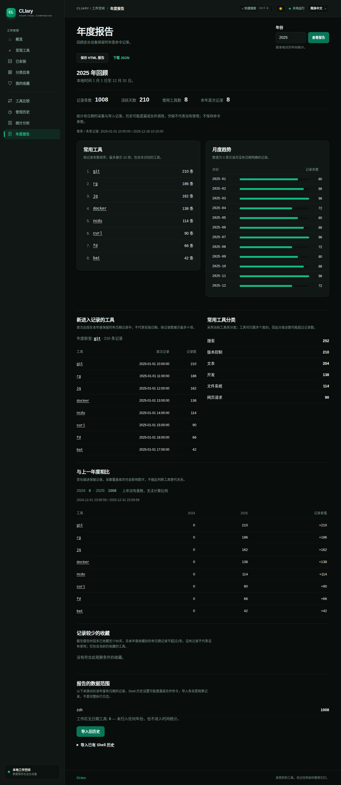

# CLIary

**Discover your tools. Remember how you use them.**  
**发现你的工具，也记住你如何使用它们。**

CLIary is a local-first catalog, shelf, and usage diary for command-line tools on Linux and macOS. The Rust CLI and local Web UI share the same Core and SQLite data. There is no account or required server.

## CLI demo / 命令行演示

Search by task, inspect a tool, then compare alternatives. This 36-second loop replays real CLI output from an isolated demo workspace; usage counts are synthetic, installation status is **Not scanned**, and playback timing is edited for readability.

按任务搜索 → 查看 ncdu 速查指令 → 比较 ncdu 与 dust。实际命令输出，独立演示环境、人工使用记录；播放节奏经过调整，不代表执行耗时。



Prefer a still image? See the Web screenshots below. [Transcript and reproduction instructions](docs/screenshots/README.md#cli-gif).

## Web preview / 界面预览

Desktop Web UI with Chinese/English and dark/light themes. These captures use an isolated workspace with **synthetic usage history**, not personal records; Catalog facts come from the bundled data. Installation status is deliberately **Not scanned**.

截图使用独立演示工作区和**人工使用历史**，不包含个人记录；工具信息来自真实内置 Catalog，安装状态保留「尚未扫描」。

### Overview / 工作台概览



<details>
<summary>更多截图：任务搜索、工具比较、年度报告 / More screenshots</summary>

### Search by task / 按任务找工具

Describe a task without remembering the tool name; ranking is local and requires no model.



### Compare tools / 工具横向对比

Compare recorded features while keeping unsupported and unrecorded values distinct.



### Annual report / 年度报告

Review dated observations, monthly trends and data-backed insights; export locally as HTML/JSON.



</details>

Use **Ctrl+K** on Linux/Windows, **⌘K** on macOS, or **/** outside an editor to focus global search. Clicking the top-right search link does the same. Typing `/` in an input, textarea or editable region remains ordinary text input.

Linux／Windows 用 **Ctrl+K**，macOS 用 **⌘K**；未编辑文本时也可按 **/**。右上角点击与快捷键使用同一入口，跨页后自动聚焦。

Capture provenance and demo setup: [screenshots](docs/screenshots/README.md).

## Build and try

```sh
cargo build --release -p cliary-cli
target/release/cliary search "disk usage"
target/release/cliary --lang zh-CN search 磁盘空间
target/release/cliary show ncdu
target/release/cliary compare ncdu gdu dust dua
target/release/cliary scan
target/release/cliary installed
target/release/cliary web
```

`cliary web` serves `http://127.0.0.1:8848` on the loopback interface only. A bundled Catalog makes the first run fully offline. The Release installer downloads a checksum-verified binary, then asks whether to scan installed tools and enable Shell history; **Yes** is the interactive default for each. For unattended installs, pass `--scan` or `--no-scan` and `--enable-history` or `--no-history`. If you run a locally built binary directly, its first interactive launch offers the same setup. Non-interactive first launches scan automatically but leave Shell history disabled.

If you skip scanning, installation status remains **Not scanned** until you run `cliary scan`.

### Install from a private release or offline package

Linux release packages use statically linked musl binaries, with **no glibc runtime dependency**. This first release provides a Linux x86_64 package; macOS and ARM64 can be built from source pending native package validation.

Linux 发布包使用 musl 静态链接，无需安装 glibc 或 musl 运行库。首发提供已验证的 Linux x86_64 安装包；macOS／ARM64 暂以源码构建使用。

To reproduce the static Linux x86_64 build, install `musl-tools` on Debian/Ubuntu, then:

```sh
rustup target add x86_64-unknown-linux-musl
CC_x86_64_unknown_linux_musl=musl-gcc \
CARGO_TARGET_X86_64_UNKNOWN_LINUX_MUSL_LINKER=musl-gcc \
cargo build --release --locked --target x86_64-unknown-linux-musl -p cliary-cli
```

The resulting executable is `target/x86_64-unknown-linux-musl/release/cliary`. Release packaging strips unused symbols; it does not require Rust, SQLite, glibc or a musl loader to be installed on the destination computer. Operating-system utilities used by optional scanning and Shell integration remain separate requirements.

The current repository is private. Anonymous `curl` downloads do not work for its releases. After a release is published, use GitHub CLI with repository access:

```sh
gh auth login
CLIARY_REPO=samael0119/CLIary sh scripts/install.sh --github
# To pin an upgrade: add --tag v0.1.0
```

The installer uses `gh` to authenticate and download the archive and checksums from the same release. Credentials stay with GitHub CLI; CLIary does not save them or forward them to Catalog URLs. For a public repository, the ordinary HTTPS installer remains available.

A downloaded or locally built package can be installed without a repository or network:

```sh
sh scripts/install.sh --from /path/to/release-assets
# Unattended: add --no-scan --no-history
```

The directory must contain `cliary-<platform-target>.tar.gz` (with a `cliary` binary) and `SHA256SUMS`. A checksum failure leaves the installed binary untouched. Upgrades replace the binary atomically and preserve personal databases and configuration; restart a running Web server afterward to use the new binary. Existing Shell hooks stay in place; run `cliary setup shell --enable` to update them if upgrading from an older hook implementation.

On Linux, the installer prefers `cliary-x86_64-unknown-linux-musl.tar.gz` (or the corresponding ARM64 target). It reads the fixed release's checksums first and also accepts an older `*-unknown-linux-gnu.tar.gz` package when a musl entry is absent, including offline installs. Both paths verify checksums. GNU packages retain their own glibc requirements.

私有仓库使用已登录的 `gh` 下载；离线安装使用 `--from`。默认仍会询问扫描、未来历史采集与旧历史预览；不自动导入旧历史。

### Development environment scanning

Scanning checks `PATH` first, then the executable directories below and common system/user directories. The first executable with a given name wins, so `PATH` takes precedence.

| Environment | Additional executable directories |
| --- | --- |
| Java | `$JAVA_HOME/bin` |
| Go | `$GOROOT/bin`, `$GOBIN`, each `$GOPATH/bin`; `~/go/bin` when `GOPATH` is unset or empty |
| Rust | `$CARGO_HOME/bin`, `~/.cargo/bin` |
| Python | `$VIRTUAL_ENV/bin`, `$CONDA_PREFIX/bin`, `$PYENV_ROOT/shims` and `bin`, `$PIPX_BIN_DIR`, `~/.pyenv/shims`, `~/.local/bin` |
| Node.js | `$NVM_BIN`, `$VOLTA_HOME/bin`, `$npm_config_prefix/bin`, `$NPM_CONFIG_PREFIX/bin`, `$PNPM_HOME` and `bin`, `~/.volta/bin` |
| Bun / Deno | `$BUN_INSTALL/bin`, `$DENO_INSTALL/bin`, `~/.bun/bin`, `~/.deno/bin` |
| Ruby | `$GEM_HOME/bin`, each `$GEM_PATH/bin`, `$RBENV_ROOT/shims` and `bin`, `~/.rbenv/shims` |
| PHP Composer | `$COMPOSER_HOME/vendor/bin`, `~/.composer/vendor/bin`, `~/.config/composer/vendor/bin` |
| .NET | `$DOTNET_ROOT`, `~/.dotnet`, `~/.dotnet/tools` |
| asdf managed languages | `$ASDF_DATA_DIR/shims`, `~/.asdf/shims` |

C/C++, Swift and other tools exposed through `PATH` are also discovered. Use the standard Go variable `GOROOT`, rather than `GO_ROOT`. Only executable files are recorded; empty values and missing directories are skipped. Directory scanning inspects files without running discovered programs; package inventory uses the available package managers. CLIary does not recursively search projects, inactive environments or SDK versions. Custom executable directories beyond these conventions should be added to `PATH`.

Each package-inventory command is bounded to three seconds and 8 MiB of output, including output inherited by child processes. A timeout or invalid output skips that inventory source; directory discovery still records executables, with ownership potentially shown as **Not detected**. Scanning several package managers can take more than three seconds overall.

After changing exported environment variables or installing new tools, run `cliary scan` again in a terminal that has those values. A running Web UI inherits the environment of the process that launched it.

Shell capture can be enabled or removed later:

```sh
cliary setup shell --enable
cliary setup shell --disable
cliary setup shell --shell fish --enable
```

CLIary stores the executable name, timestamp, and a random local machine ID for each captured invocation. It never stores command arguments. Bash history settings may cause some commands to be skipped; compound commands are represented by their first external executable. The Shell hook runs recording in the background so database failures do not interrupt the original command.

Zsh capture uses the actual alias-expanded executable supplied by its `preexec` hook: `gst` defined as `git status` counts toward `git`, while retaining `gst` as the entered name. Ordinary aliases and alias chains work without a list of plugin-specific shortcuts. Functions shadowing external tools are excluded. To update an existing installed hook after rebuilding, run `./target/debug/cliary setup shell --shell zsh --enable`, then open a new terminal. Bash/Fish live hooks retain their existing executable-only behavior.

### When history or statistics are empty

Scanning installed tools does not enable usage capture. Run `cliary setup shell --enable` in your usual Shell, open a new terminal, run an external tool such as `git --version`, and refresh the Web page after the next command prompt. For a locally built binary outside `PATH`, replace `cliary` with its actual path. The History and Statistics pages provide these steps when there are no records.

If records are still missing, check `cliary history` in the terminal and verify that it and the Web UI use the same data directory (`CLIARY_DATA_DIR` / `XDG_DATA_HOME`). Existing Shell history is not imported automatically; use the opt-in import below. The Web Statistics page only shows the last 30 days; older records remain in History. Disable future capture with `cliary setup shell --disable` and open a new terminal; saved records remain.

## Import existing Shell history / 导入旧历史

The first interactive run offers an optional history guide after installed-tool scanning and future capture setup. Existing installations also get the import guide once, even if scanning is already complete. It lists common/custom Bash, Zsh and Fish history paths without reading contents, previews only after selection, and defaults to **no import**. You can process several Shell files, supply an optional alias snapshot, and see counts/date ranges before applying. Skips are remembered; incomplete input remains retryable. Non-interactive and JSON commands never open the guide.

Run `cliary setup history` to reopen it at any time. The installer invokes this same guide when interactive; otherwise it prints the entry point. `install.sh --no-import-history` skips the guide, while `--no-history` skips both future capture and this guide. Reading/importing a historical file never enables future capture.

**Web 操作**：打开「使用历史 → 导入旧历史」，选择检测到的文件或输入本机路径，点击「预览这份文件」，核对后再点击「确认导入」。可选填别名快照路径；成功后可查看历史与年报。预览保留10分钟（最多4份），重启后失效。确认使用已预览的解析快照，保存时重新去重；文件变化不会替换这次预览。导入页面不缓存到浏览器，程序也不保存原始命令。

In the Web UI, choose **History → Import existing history**. Select a detected file or enter a local path, preview, then confirm. Optional alias snapshots resolve names such as `gst`. Previews last ten minutes, up to four at once, and are lost on restart; confirmation saves the reviewed snapshot and rechecks duplicate counts. Import pages use `Cache-Control: no-store`.

首次交互运行会询问是否预览旧历史，再分别确认每份文件的导入；默认不导入。已有安装也会提示一次，跳过后可用 `cliary setup history` 重开。无日期记录只进入观察列表，不会被分配到某个年份；别名表仍须由日常 Shell 显式导出。

```sh
cliary import-history --shell zsh --file "$HISTFILE"          # Preview only
cliary import-history --shell zsh --file "$HISTFILE" --apply  # Explicit import
cliary import-history --shell bash --file ~/.bash_history
cliary import-history --shell fish --file ~/.local/share/fish/fish_history
cliary history --undated --json
```

Use the actual file your Shell writes; custom `HISTFILE` / XDG paths may differ. CLIary reads only the selected regular file (UTF-8, up to 32 MiB; Zsh metafied bytes are decoded). No Shell is invoked. Preview shows counts, date range and up to 20 executable names; add `--apply` to commit in one transaction. Raw arguments, paths and command strings are never saved or shown.

Bash `#epoch` timestamps, Zsh extended `: epoch:duration;command` and Fish `when` timestamps enter dated statistics. Plain history without timestamps goes into a separate **undated observations** list, never into a guessed year. Invalid/future timestamps, builtins, compound commands, pipelines, substitutions and multiline commands are skipped conservatively; known `sudo`, `env`, assignments and `command` prefixes are supported. A history file alone cannot establish alias/function definitions; literal names may be unmatched. An explicit alias snapshot can supply evidence for ordinary aliases as described below.

Repeated import, copied files and overlapping live capture are deduplicated using this device's executable, second and occurrence number. Same-second repeats in one snapshot retain multiplicity; another snapshot retains the largest observed multiplicity, so indistinguishable same-second commands can be undercounted. Undated counts likewise keep the maximum snapshot count, rather than accumulating on each import. Files from another machine should not be mixed into this device's history. Fish and Shell history settings may merge, omit or trim entries: an imported entry is an observation, not proof of every execution.

导入默认只预览；必须加 `--apply` 才保存。仅记录程序名、可靠时间与来源，不保存完整命令或参数。没有日期的记录可通过 `history --undated` 查看，不进入年报。已有数据库自动升级至 v2，保留记录、收藏和备注；旧版程序不能再打开升级后的数据库。

Format references: [Bash manual](https://www.gnu.org/software/bash/manual/html_node/Bash-History-Facilities.html), [Zsh extended history](https://zsh.sourceforge.io/Doc/Release/Options.html), [Fish history format](https://github.com/fish-shell/fish-shell/blob/master/src/history/yaml_backend.rs).

### Resolve aliases in old history / 解析历史中的别名

Export aliases **in your usual interactive Shell**, where the plugins have already loaded:

```sh
cliary_aliases_file="$(mktemp)"   # Private temporary file
builtin alias -L > "$cliary_aliases_file"  # Zsh; Bash: builtin alias -p
./target/debug/cliary import-history --shell zsh --file "$HISTFILE" --aliases-file "$cliary_aliases_file"
./target/debug/cliary import-history --shell zsh --file "$HISTFILE" --aliases-file "$cliary_aliases_file" --apply
rm -- "$cliary_aliases_file"
```

`--aliases-file` accepts UTF-8 regular files up to 4 MiB containing Zsh `alias -L` or Bash `alias -p` output. It is parsed as data; nothing is sourced or executed. Preview adds executable-only mappings such as `gst → git` and a count of existing unmatched imported records to classify. Applying can classify matching dated imported records without appending duplicate entries or changing original executable names, timestamps or import keys. Already assigned tool IDs and live capture records are preserved. Statistics and annual reports group recognized aliases by the existing Catalog tool ID; `history gst` can still show that entered name. Targets absent from the Catalog remain unmatched.

A current snapshot describes current definitions, not proof of an old configuration; choose a historical snapshot if an alias changed. Chains are bounded to 16 steps; cycles, builtins and complex expansions are skipped, and functions/global/suffix aliases are not inferred. Quoted, escaped, path-qualified or wrapper-argument calls do not expand aliases. A snapshot mixing these forms with plain calls of the same name conservatively leaves that name unmatched. Undated observations keep the entered name and remain outside all time statistics. Snapshot bodies and arguments are never saved in SQLite or emitted in previews; the temporary export itself may contain private alias values and should be removed after use. Reports remain at tool level, without separate `git status`/`git checkout` rankings.

历史导入的别名表由你显式导出、预览和应用；程序不自动加载 `.zshrc` 或插件。`gst` 归到 `git` 后，旧导入记录的总条数不变；仅修正未识别记录的工具归属。没有日期的记录仍不进入年报。

Mechanism references: [Zsh preexec arguments](https://zsh.sourceforge.io/Doc/Release/Functions.html), [Zsh alias export](https://zsh.sourceforge.io/Doc/Release/Shell-Builtin-Commands.html).

## Commands

`import-history`, `search`, `show`, `compare`, `installed`, `scan`, `categories`, `favorites`, `favorite`, `note`, `history`, `stats`, `wrapped`, `sync`, `web`, `config`, and `setup shell` are available. Read commands support `--json`, whose keys stay in English. `cliary note <tool>` opens `$EDITOR`; `--set` and `--delete` are available for scripts. `cliary stats --period 30d` and `cliary stats --year 2026` select periods.

## Annual report / 年度报告

```sh
cliary wrapped                  # Current local year / 当前本地年份
cliary wrapped 2024             # A specific calendar year / 指定日历年
cliary wrapped 2024 --json      # Structured report / 结构化报告
cliary --lang zh-CN wrapped 2024
```

In the Web UI, choose **Wrapped / 年度报告** from the sidebar, or visit `/wrapped?year=2024`. Reports show dated captured/imported entries, active days, tools used, first/last records, the top ten tools, and all twelve months. Web, JSON and CLI also include first-recorded tools, a top newly recorded tool, current Catalog categories, low-activity favorites, previous-year comparisons and data sources. Executable aliases recorded with the same tool ID count as one tool; unknown executables remain visible. The current year is marked as in progress. Years from 1 through 9998 are accepted.

Statistics use the device's local calendar time at report generation. Only retained dated capture and imported history entries are counted: a zero means no records, not necessarily no usage. Shell history can omit or merge executions. Enable `cliary setup shell --enable` and open a new terminal to capture future commands; earlier commands are not imported. Command arguments are never stored. Reports are generated locally, require no AI or network connection, and do not modify usage events.

网页侧栏选择「年度报告」，可查看有日期的采集与导入记录、活跃天数、常用工具、新工具、年度新宠、分类、低频收藏、月度趋势与年度变化。记录不代表完整使用历史，空月份不等于没有使用。当前年按上年相同本地月日时刻对比，闰日收敛到上年2月28日；无上年基数时不计算增长比例。

Save an offline report from the Web export links or the CLI:

```sh
cliary wrapped 2024 --output wrapped-2024.html
cliary wrapped 2024 --output wrapped-2024.json --format json
```

HTML has embedded styles, no script, no external resources, and no app navigation links. It opens without CLIary running and can be printed from a browser. CLI exports create private files (0600 on Unix) and refuse to overwrite existing paths. Web exports use attachment headers and no-store caching. Exports include only aggregated report facts, never raw history, arguments or machine IDs.

New tools mean first observation in retained dated records, not first installation. Low-activity favorites must still be saved, have been saved at least 90 days by the report cutoff, and have at most two entries after saving within the selected year. Categories use current Catalog metadata and can overlap. Record changes do not establish complete usage or replacement of one tool by another.

Favorites survive Catalog updates that remove tools. `cliary favorites` and the Web Favorites page show unavailable entries by their saved ID; remove them with `cliary favorite <id> --remove --exact-id` or the page's **Remove favorite** button. Exact ID removal is safe to retry even if a different tool later uses that ID as an alias; ordinary `--remove` still supports current names and aliases. Removing a bookmark keeps notes and usage history. If the same ID returns to the Catalog, its tool details appear again. In `favorites --json`, available entries keep their Tool object shape; unavailable entries contain only `id` and `catalog_available: false` (tool metadata is absent). Core callers needing every bookmark should use `favorite_entries()`; `favorites()` returns only entries with current metadata.

`--lang en` and `--lang zh-CN` temporarily override the language. `cliary config set language zh-CN` saves it. Search indexes both languages regardless of the UI language.

## Browse installed tools

The Web **Installed** page defaults to catalog matches. Choose **All binaries** or **Unmatched binaries** to browse the complete saved scan, including programs not in the Catalog. Combine name/path search, recorded source, exact executable directory, and Catalog category filters. Missing sources are shown as **Not detected**; directories describe discovery locations and do not establish package ownership. Category filters apply only to Catalog matches.

Results are paginated in groups of 100 without truncating the scan. Pagination preserves filters in the URL; applying new filters starts at the first page. **Clear filters** retains the selected match status. Install or remove tools, then re-scan to update the snapshot.

## Compare tools

Compare 2–8 distinct tools with `cliary compare ncdu gdu dust dua`, or enter comma-separated names on the Web **Compare** page. Aliases resolve to one Catalog entry, so `rg, ripgrep, grep` produces two tool columns. Unknown names must be corrected before comparing.

Each recorded feature gets its own row: **Supported**, **Not supported**, or **Not recorded**. Missing data is never interpreted as a negative. The Web highlights rows with both explicit supported and unsupported values; a missing value alone does not establish a difference. Purpose descriptions and command examples come directly from the Catalog; examples are displayed without execution. Installation status reflects the saved scan, with **Not scanned** shown before scanning.

The CLI lists longer package details, repository links and examples beneath the matrix. The Web table scrolls horizontally for larger comparisons and keeps dimension labels visible; focus the table to scroll with arrow keys. `--json` retains feature keys and booleans and adds the localized `description` map and `common_commands` array.

## Data and updates

- Config: `~/.config/cliary/config.toml`
- Shared Catalog: `~/.local/share/cliary/catalog.db`
- Favorites, notes, installed snapshot, and usage events: `~/.local/share/cliary/user.db`
- Cache: `~/.cache/cliary/`

XDG base directories and `CLIARY_CONFIG_DIR`, `CLIARY_DATA_DIR`, and `CLIARY_CACHE_DIR` are supported. A Catalog update replaces only `catalog.db`. Public Release builds can have a built-in GitHub Catalog URL; source builds can use `cliary sync --url https://github.com/OWNER/REPO/releases/latest/download` or set `catalog_url` in `config.toml`.

For private releases, first download the Catalog assets with GitHub CLI, then import them locally:

```sh
cliary_assets_dir="$(mktemp -d)"
cliary_release_tag="$(gh release view --repo samael0119/CLIary --json tagName --jq .tagName)"
gh release download "$cliary_release_tag" --repo samael0119/CLIary --pattern manifest.json --pattern catalog.db.zst --dir "$cliary_assets_dir"
cliary sync --from "$cliary_assets_dir"
rm -rf -- "$cliary_assets_dir"
```

`sync --from` checks schema, SHA-256, decompressed size, SQLite integrity and Catalog metadata before replacement. It only accepts newer Catalog versions and leaves `user.db` unchanged. `--from`, `--url` and `--bundled` are mutually exclusive. Neither anonymous `sync --url` nor an embedded URL can authenticate to a private release; do not place credentials in URLs or configuration. `sync --bundled` remains the simpler offline option when the desired Catalog ships with the new binary.

`history <tool>` matches saved tool IDs, exact captured executable names, and current Catalog aliases. If a Catalog entry is removed, its existing usage events remain queryable by the saved ID or executable name; `stats` retains those records instead of requiring the old entry. First-recorded dates come from usage events, so a Catalog update does not by itself make an existing tool newly used. Catalog updates do not rewrite saved records or IDs; an explicitly applied alias snapshot can classify previously unmatched imported records. Categorization still uses current Catalog metadata when available.

Catalog 条目移除后，可用原工具 ID 或实际命令名查询已保存的历史，统计也会保留这些记录。首次使用按真实记录时间计算，不因工具库更新而重置；Catalog 更新不会改写或自动合并旧记录。显式应用别名表可归类此前未识别的导入记录。

## Search by task or tool name

Search is entirely local and works without a model. All 55 bundled tools have English/Chinese task keywords and purpose tags. Names, aliases and executable names take precedence; task keywords and specific tags outweigh broad category matches. Chinese phrases and basic English plurals are handled lexically, without interpreting arbitrary instructions or filter constraints.

```sh
target/debug/cliary search "想知道电脑里哪个文件夹占地方"
target/debug/cliary search "看一下仓库过去的提交"
target/debug/cliary search "从 JSON 中提取字段"
target/debug/cliary search "find files by name"
```

The Web Discovery page uses the same ranking. There are 61 fixed query cases, including 47 task descriptions. Run the isolated CLI evaluation with:

```sh
python3 scripts/evaluate_search.py
cargo test -p cliary-core --test search_quality
```

Recognized unmodified older bundled catalogs update automatically when a new binary opens them. Custom catalogs and synced catalogs with version >1 are preserved. To explicitly replace the Catalog with the current binary's bundled data, offline:

```sh
cliary sync --bundled
```

This preserves favorites, notes, the installed snapshot and usage history in `user.db`. A refreshed bundled Catalog uses version 1; a later remote sync can replace it with a newer version. Restart a running Web process to load the new binary. Search queries are limited to 4096 UTF-8 bytes.

## Contribute Catalog entries

Add one YAML file under `catalog/tools/<category>/`. English description and at least one executable are required; Simplified Chinese descriptions are encouraged. Categories and tags use stable IDs in `catalog/i18n/`. Validate locally:

```sh
python3 -m pip install PyYAML jsonschema
python3 scripts/validate_catalog.py
cargo run -p cliary-catalog --bin cliary-catalog-build -- validate
cargo test --workspace
```

The repository contains a GitHub Actions workflow for Catalog validation and four-platform packaging. Automated publishing is currently deferred; merging to `main` alone is not evidence that a release exists. `cliary sync` checks the manifest and SHA-256 digest before replacing the local Catalog.

## V0.1 boundaries

Wrapped includes data-backed annual insights and comparison of recorded entries. Semantic/AI search, user accounts, and automatic execution of installation commands are planned for later releases.
